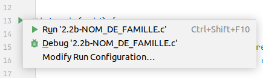

# IHDCB131 Programmation 1 - 2023-2024

## Que contient ce repository GitHub ?

Ce repository contient tous les templates d'exercice à réaliser dans le cadre du cours IHDCB131 - Programmation 1 à l'UNamur. Pour presque tous les exercices WebCampus demandant de rendre du code, un template de solution est proposé ici comme base de réflexion. Le template est à compléter et à renvoyer sur WebCampus en modifiant le nom du fichier en remplaçant **NOM_DE_FAMILLE** par votre nom de famille.

## Comment utiliser ce repository ?

Nous sommes sur GitHub, un système de gestion de version de fichiers (plus d'informations sur GitHub [ici](https://docs.github.com/fr/get-started)). Dans le cadre de ce cours, vous ne devez pas savoir grand chose sur GitHub à part comment cloner un projet et comment récupérer les modifications que j'apporterai à ce repository.

### 1. Créer un compte GitHub

Si vous n'avez pas déjà de compte GitHub, rendez-vous sur [GitHub](https://github.com/) et créez un compte avec votre adresse mail UNamur. Assurez-vous de vous connecter à ce compte avant de continuer.

### 2. (si vous travaillez sur votre ordinateur) Installez Git

Si Git n'est pas déjà installé sur votre ordinateur, vous pouvez le télécharger et l'installer à partir du site officiel de Git : [Télécharger Git](https://git-scm.com/downloads). Une fois l'installation terminée, vous pouvez vérifier si Git est bien installé en ouvrant une invite de commande (ou un terminal) et en tapant **`git --version`**. Vous devriez voir la version de Git s'afficher.

### 3. Cloner le repository

Le clonage d'un repository GitHub est le fait de créer une copie de ce repository qui est sur GitHub sur votre machine. Cela vous permet de modifier de votre côté les différents fichiers que je vous mets à disposition. Pour cloner ce repository, suivez [ce tutoriel](https://docs.github.com/fr/repositories/creating-and-managing-repositories/cloning-a-repository?tool=webui#cloning-a-repository)

### 4. Accédez au repository cloné

Une fois le clonage terminé, utilisez la commande **cd** (sur Linux) pour accéder au repository cloné:
```bash
cd votre-repository
```
Vous êtes maintenant prêt à modifier les templates d'exercices!

### 5. (sur votre ordinateur) Ouvrez le repository sur CLion

Ouvrez CLion et ouvrez un projet (File -> Open...). Choisissez le répertoire IHDCB131_Students (qui est le répertoire que vous venez de cloner). C'est tout! Vous pouvez maintenant modifier les templates et les exécuter à l'envie!

### 6. Récupérez les mises à jour

Chaque fois que je publie de nouveaux exercices ou des modifications des exercices déjà présents (pour corriger des erreurs par exemple), vous pouvez les récupérer en suivant ces étapes:

1. Ouvrez votre terminal/commande et assurez-vous d'être dans le répertoire cloné du repository.
2. Utilisez la commande suivante pour récupérer les mises à jour depuis GitHub :
```bash
git pull origin main
```

Cela mettra à jour votre répertoire local avec les dernières modifications.

C'est tout ! Vous savez maintenant comment cloner ce repository, modifier les templates d'exercices et récupérer les mises à jour. N'hésitez pas à me contacter si vous avez des questions ou des problèmes.

## Comment exécuter un exercice sur CLion ?

Une fois que toutes les étapes de la section précédente ont été suivies et que vous avez modifié un exercice, vous voudrez l'exécuter (et vous aurez bien raison!). Pour ce faire, rien de plus simple. Lorsque vous avez ouvert un fichier, vous verrez un petit triangle vert à gauche de la ligne où la méthode **main** est définie. Par exemple, pour l'exercice 2.2b, cela donne ceci :


Il vous suffit de cliquer dessus et puis de cliquer sur "Run" comme sur l'image ci-dessous :



Voilà, votre programme est exécuté et le résultat est montré dans le terminal de CLion!